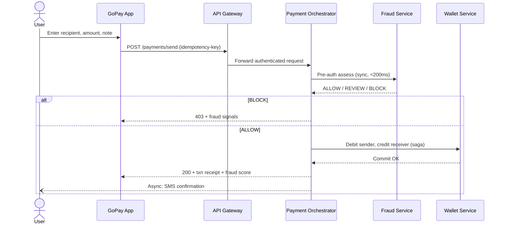

# GoPay — Product Requirements Document (PRD)

| Field | Value |
|-------|-------|
| **Product** | GoPay |
| **Version** | 1.0 |
| **Status** | Draft |
| **Last updated** | July 2026 |
| **Audience** | Product, Engineering, Design, Compliance |
| **Companion doc** | [TRD.md](./TRD.md) |

---

## 1. Executive Summary

GoPay is a unified digital payments and financial wellness platform for Indian consumers and merchants. It combines **wallet-based P2P transfers**, **UPI-style payments**, **credit scoring**, **fraud protection**, and **embedded lending** into a single experience.

Today, GoPay exists as a functional prototype: React frontend, Spring Boot API, and Python ML services for fraud and credit scoring, backed by file-based JSON storage. This PRD defines the **target product** — a comprehensive, production-grade platform delivered through a **microservices architecture** — and organizes features into a phased roadmap from current state to full vision.

**North-star outcome:** Users can send money instantly with confidence, merchants can accept payments with low friction, and GoPay can underwrite and disburse credit safely using real-time risk intelligence.

---

## 2. Problem Statement

### 2.1 User problems

| Persona | Pain today | GoPay solves |
|---------|------------|--------------|
| **Retail payer** | Fragmented apps for payments, credit checks, and fraud alerts | One wallet with transparent risk signals before every payment |
| **Small merchant** | High chargeback/fraud exposure, delayed settlements | P2M flows with merchant risk controls and faster settlement |
| **Credit seeker** | Opaque credit decisions, slow loan disbursement | In-app credit score, pre-approved offers, UPI disbursement |
| **Trust & Safety analyst** | Manual review of suspicious transactions | Fraud console with case management, velocity dashboards, ML explainability |

### 2.2 Business problems

- Monolithic coupling limits independent scaling of payments vs. ML vs. lending.
- File-based storage cannot support concurrent users, audit trails, or regulatory reporting.
- Fraud `REVIEW` cases are logged but not operationalized into a human workflow.
- Marketing promises (UPI P2M, lending, Kafka events) exceed current implementation.

---

## 3. Product Vision & Goals

### 3.1 Vision

> **Pay instantly. Track everything. Borrow smarter.**

GoPay becomes India's trusted super-app for everyday money movement — with built-in intelligence that protects users before money leaves their wallet.

### 3.2 Strategic goals (12–18 months)

| # | Goal | Success indicator |
|---|------|-------------------|
| G1 | **Safe payments at scale** | < 0.1% fraud loss rate; < 200 ms p95 fraud pre-check |
| G2 | **Unified financial identity** | Single profile with KYC, VPA, bank link, credit score |
| G3 | **Embedded lending** | Loan application → disbursement in < 5 minutes for pre-approved users |
| G4 | **Merchant growth** | P2M acceptance with settlement T+1 and dispute workflow |
| G5 | **Operational excellence** | 99.9% API availability; full audit trail for regulators |

### 3.3 Non-goals (v1 production scope)

- Cross-border remittance
- Cryptocurrency / stablecoin rails
- Full NBFC license operations (partner-led lending in early phases)
- Physical card issuance

---

## 4. User Personas

### 4.1 Priya — Everyday Payer (Primary)

- **Age:** 28 | **Location:** Tier-1 city | **Income:** Salaried
- **Needs:** Quick P2P to friends/family, balance visibility, fraud warnings
- **Behaviors:** Uses UPI daily; wary of unknown VPAs; checks transaction history weekly

### 4.2 Rajesh — Kirana Merchant (Secondary)

- **Age:** 42 | **Location:** Tier-2 city | **Business:** Small retail
- **Needs:** QR-based collections, daily settlement summary, chargeback protection
- **Behaviors:** Prefers simple Hindi UI; needs SMS/WhatsApp payment confirmations

### 4.3 Ananya — Credit Builder (Secondary)

- **Age:** 24 | **Location:** Tier-1 city | **Profile:** Thin credit file
- **Needs:** Transparent credit score, tips to improve, small personal loans
- **Behaviors:** Checks score before applying elsewhere; price-sensitive on interest

### 4.4 Ops Analyst — Trust & Safety (Internal)

- **Role:** Fraud operations at GoPay
- **Needs:** Case queue, user/txn context, block/unblock actions, SLA tracking
- **Behaviors:** Works from fraud dashboard; escalates high-value `REVIEW` cases

---

## 5. Current State (Baseline)

Features **implemented today** in the prototype:

| Domain | Feature | Status |
|--------|---------|--------|
| Auth | Signup/login (email or mobile), logout, bearer sessions | ✅ Live |
| Profile | View/update name, mobile, VPA, bank account, IFSC | ✅ Live |
| Profile | Live VPA spoofing + IFSC validation (fraud-engine) | ✅ Live |
| Wallet | INR balance, default ₹10,000 on signup | ✅ Live |
| Payments | P2P send by email/phone, max ₹1L/txn | ✅ Live |
| Payments | Pre-txn fraud gate (BLOCK stops payment) | ✅ Live |
| History | Sent/received transaction list with fraud metadata | ✅ Live |
| Credit | CIBIL-style score 300–900 with breakdown | ✅ Live |
| Fraud | Velocity dashboard, fraud event log | ✅ Live |
| ML | XGBoost fraud scoring (20 features), GradientBoosting credit (8 features) | ✅ Live |
| Marketing | Home page references UPI P2M, lending, Kafka | 🔶 Aspirational |

**Known product gaps:** No OTP/KYC, no merchant flows, no lending, no notifications, no admin console, no dispute/refund, `REVIEW` fraud cases not enforced.

---

## 6. Target Product Scope

### 6.1 Feature map by domain

```
┌─────────────────────────────────────────────────────────────────────────┐
│                           GoPay Product Surface                          │
├─────────────┬─────────────┬─────────────┬─────────────┬───────────────────┤
│  Identity   │   Wallet    │  Payments   │   Credit    │  Trust & Safety   │
│  & KYC      │  & Ledger   │  (P2P/P2M)  │  & Lending  │  & Fraud          │
├─────────────┼─────────────┼─────────────┼─────────────┼───────────────────┤
│ Signup/Login│ Balance     │ Send money  │ Credit score│ Fraud pre-check   │
│ OTP verify  │ Top-up      │ Request $   │ Score tips  │ Velocity limits   │
│ KYC (PAN)   │ Withdraw    │ QR pay (P2M)│ Pre-approval│ Case management   │
│ Profile     │ Statements  │ Recurring   │ Loan apply  │ Blocklist mgmt    │
│ Device trust│ Multi-acct  │ Refunds     │ EMI schedule│ ML explainability │
│ Sessions    │ Limits      │ Split bill  │ Disbursement│ Admin console     │
└─────────────┴─────────────┴─────────────┴─────────────┴───────────────────┘
         │              │              │              │              │
         └──────────────┴──────────────┴──────────────┴──────────────┘
                                    │
                    ┌───────────────┴───────────────┐
                    │  Notifications & Engagement   │
                    │  SMS • Push • Email • In-app  │
                    └───────────────────────────────┘
```

---

## 7. Functional Requirements

Requirements use **MoSCoW** priority: **M** Must, **S** Should, **C** Could, **W** Won't (this phase).

### 7.1 Identity & Authentication

| ID | Requirement | Priority | Phase |
|----|-------------|----------|-------|
| AUTH-01 | User can sign up with name, email, password, 10-digit mobile | M | ✅ Done |
| AUTH-02 | User can log in with email **or** mobile | M | ✅ Done |
| AUTH-03 | User can log out and invalidate session | M | ✅ Done |
| AUTH-04 | OTP verification on signup and sensitive actions (send > ₹10K, profile bank change) | M | P1 |
| AUTH-05 | JWT-based auth with refresh tokens (replace localStorage bearer-only) | M | P1 |
| AUTH-06 | Device registration and "trusted device" flag | S | P2 |
| AUTH-07 | Multi-factor authentication (TOTP / SMS) | S | P2 |
| AUTH-08 | Social login (Google) | C | P3 |
| AUTH-09 | Account lockout after N failed login attempts | M | P1 |

### 7.2 KYC & Profile

| ID | Requirement | Priority | Phase |
|----|-------------|----------|-------|
| KYC-01 | User can view and edit profile (name, mobile, VPA, bank, IFSC) | M | ✅ Done |
| KYC-02 | Server validates VPA format and spoofing risk before save | M | ✅ Done |
| KYC-03 | Server validates IFSC against bank registry | M | ✅ Done |
| KYC-04 | PAN + Aadhaar-lite KYC flow with document upload | M | P2 |
| KYC-05 | KYC status badge on profile (Unverified / Pending / Verified) | M | P2 |
| KYC-06 | KYC tier gates features (e.g., ₹1L/day requires Full KYC) | S | P2 |

### 7.3 Wallet & Ledger

| ID | Requirement | Priority | Phase |
|----|-------------|----------|-------|
| WAL-01 | User sees real-time INR wallet balance | M | ✅ Done |
| WAL-02 | Double-entry ledger (debit/credit entries, immutable log) | M | P1 |
| WAL-03 | Wallet top-up via UPI collect / payment gateway | M | P2 |
| WAL-04 | Withdraw to linked bank account (IMPS/NEFT) | S | P2 |
| WAL-05 | Downloadable account statement (PDF/CSV, date range) | S | P2 |
| WAL-06 | Daily/monthly spending limits configurable per KYC tier | M | P1 |
| WAL-07 | Low-balance alerts | C | P3 |

### 7.4 Payments — P2P

| ID | Requirement | Priority | Phase |
|----|-------------|----------|-------|
| PAY-01 | Send money to recipient by email or mobile | M | ✅ Done |
| PAY-02 | Send money to recipient by VPA / UPI ID | M | P1 |
| PAY-03 | Optional payment note/memo | M | ✅ Done |
| PAY-04 | Pre-transaction fraud assessment; BLOCK prevents transfer | M | ✅ Done |
| PAY-05 | Idempotent send (client supplies idempotency key; no double debit) | M | P1 |
| PAY-06 | Request money from another user | S | P2 |
| PAY-07 | Split bill among multiple users | C | P3 |
| PAY-08 | Scheduled / recurring payments | C | P3 |
| PAY-09 | Refund initiated by sender within 24 hours (where allowed) | S | P2 |

### 7.5 Payments — P2M (Merchant)

| ID | Requirement | Priority | Phase |
|----|-------------|----------|-------|
| MCH-01 | Merchant onboarding with business name, category, settlement account | M | P2 |
| MCH-02 | Static and dynamic QR generation for collections | M | P2 |
| MCH-03 | Merchant dashboard: daily collections, settlement status | M | P2 |
| MCH-04 | T+1 settlement to merchant bank account | S | P2 |
| MCH-05 | Merchant-specific fraud rules (velocity, MCC limits) | M | P2 |
| MCH-06 | Refund/dispute workflow initiated by merchant or customer | S | P3 |

### 7.6 Credit & Lending

| ID | Requirement | Priority | Phase |
|----|-------------|----------|-------|
| CRD-01 | Display credit score (300–900) with band and breakdown | M | ✅ Done |
| CRD-02 | Actionable tips to improve score | S | ✅ Done |
| CRD-03 | Score recalculated on significant activity (txn, repayment) | M | P1 |
| CRD-04 | Pre-approved loan offers based on score + KYC tier | M | P2 |
| CRD-05 | Loan application flow: amount, tenure, purpose, consent | M | P2 |
| CRD-06 | Automated underwriting using credit-engine + fraud signals | M | P2 |
| CRD-07 | Disburse loan to wallet or linked bank via UPI/IMPS | M | P2 |
| CRD-08 | EMI schedule, reminders, and auto-debit from wallet | M | P2 |
| CRD-09 | Early repayment and foreclosure | S | P3 |

### 7.7 Fraud & Trust & Safety

| ID | Requirement | Priority | Phase |
|----|-------------|----------|-------|
| FRD-01 | 7-layer fraud cascade (VPA, IFSC, blacklist, velocity, ML, rules) | M | ✅ Done |
| FRD-02 | Fraud score and signals returned on every payment | M | ✅ Done |
| FRD-03 | User-facing velocity dashboard (usage vs limits) | M | ✅ Done |
| FRD-04 | Enforce `REVIEW` → hold funds in escrow pending analyst decision | M | P1 |
| FRD-05 | Internal fraud case queue with assign, comment, resolve | M | P2 |
| FRD-06 | Admin block/unblock user, VPA, device, IP | M | P2 |
| FRD-07 | Hot-reloadable blacklist (disposable domains, keywords) | S | P1 |
| FRD-08 | Fraud alert notifications to user (SMS/push) | S | P2 |
| FRD-09 | ML model explainability (top contributing features) | S | P2 |

### 7.8 Notifications & Engagement

| ID | Requirement | Priority | Phase |
|----|-------------|----------|-------|
| NTF-01 | In-app notification center | S | P2 |
| NTF-02 | SMS for OTP, payment confirmation, fraud alert | M | P1 |
| NTF-03 | Email receipts for transactions | S | P2 |
| NTF-04 | Push notifications (mobile web / future native app) | C | P3 |
| NTF-05 | Webhook subscriptions for merchant integrations | C | P3 |

### 7.9 Support & Compliance

| ID | Requirement | Priority | Phase |
|----|-------------|----------|-------|
| CMP-01 | Terms of Service and Privacy Policy pages | M | ✅ Done |
| CMP-02 | Support/contact page with ticket submission | S | P2 |
| CMP-03 | GDPR-style data export and account deletion request | S | P3 |
| CMP-04 | Audit log of all admin and sensitive user actions | M | P1 |
| CMP-05 | Transaction reporting for RBI-style compliance (design partner) | C | P3 |

---

## 8. User Journeys

### 8.1 Send money (happy path)



### 8.2 Loan application (target)

1. User views credit score and pre-approved offer on `/credit`.
2. User selects amount/tenure → consent to credit pull.
3. System runs underwriting (credit-engine + fraud history + KYC tier).
4. Approved → loan agreement e-sign → disburse to wallet.
5. EMI auto-debit on due dates; notifications 3 days before.

### 8.3 Fraud review (target)

1. Payment receives `REVIEW` → funds held in escrow wallet.
2. Case created in Trust & Safety queue with ML signals.
3. Analyst approves → release funds; or rejects → refund sender.
4. User notified of outcome within SLA (e.g., 4 hours).

---

## 9. Phased Roadmap

### Phase 0 — Baseline (Complete)

Prototype with auth, P2P, fraud ML, credit score, dashboards, file storage.

### Phase 1 — Production Foundation (0–3 months)

**Theme:** Safe, reliable core payments on microservices foundation.

| Deliverable | User value |
|-------------|------------|
| Microservices split: Auth, User, Wallet, Payment, Fraud (see TRD) | Independent scaling & deployment |
| PostgreSQL + Redis | Data durability, concurrent users |
| JWT auth, OTP on signup | Stronger security |
| Idempotent payments, ledger | No double-spend |
| `REVIEW` escrow flow | Fraud protection without false declines |
| API Gateway + unified frontend API | Clean integration |
| Docker Compose local stack | Developer velocity |

**Exit criteria:** 1K concurrent users; p95 send latency < 500 ms; zero balance corruption in load test.

### Phase 2 — Growth Features (3–6 months)

**Theme:** UPI-style payments, merchants, lending MVP.

| Deliverable | User value |
|-------------|------------|
| VPA-based send/receive | Familiar UPI UX |
| Merchant onboarding + QR | P2M collections |
| KYC flow (PAN) | Higher limits |
| Loan pre-approval + disbursement | "Borrow smarter" |
| Fraud case management console | Ops efficiency |
| Kafka event bus | Real-time analytics & async workflows |
| Notification service (SMS) | Trust & engagement |

**Exit criteria:** 100 merchants onboarded (pilot); loan disbursement < 5 min for pre-approved users.

### Phase 3 — Scale & Intelligence (6–12 months)

**Theme:** Platform maturity, partnerships, advanced ML.

| Deliverable | User value |
|-------------|------------|
| Feature store + model registry | Faster ML iteration |
| Real-time credit score updates | Dynamic offers |
| Split bills, recurring payments | Power-user features |
| Merchant settlement & disputes | Business trust |
| Admin & compliance reporting | Regulatory readiness |
| Kubernetes production deployment | 99.9% SLA |

---

## 10. UX & Design Requirements

| Area | Requirement |
|------|-------------|
| **Design system** | Extend existing GoPay Tailwind tokens; consistent across consumer and merchant surfaces |
| **Mobile-first** | All flows usable on 360px width; touch targets ≥ 44px |
| **Accessibility** | WCAG 2.1 AA for core flows (login, send, dashboard) |
| **Localization** | English v1; Hindi Phase 2 |
| **Error states** | Fraud blocks show plain-language reason + support link |
| **Loading** | Skeleton states for dashboard, optimistic UI only where safe (not payments) |
| **Security UX** | Mask bank account; confirm screen for amounts > ₹10,000 |

### Key screens (target)

| Screen | Route | Phase |
|--------|-------|-------|
| Home / marketing | `/` | ✅ |
| Login / Signup | `/login`, `/signup` | ✅ |
| Dashboard | `/dashboard` | ✅ |
| Send money | `/send` | ✅ → VPA in P1 |
| Credit score | `/credit` | ✅ → offers in P2 |
| Fraud dashboard | `/fraud` | ✅ → cases in P2 |
| Profile & KYC | `/profile` | ✅ → KYC in P2 |
| Merchant dashboard | `/merchant` | P2 |
| Loan application | `/loans/apply` | P2 |
| Notifications | `/notifications` | P2 |
| Admin / Ops console | `/ops` | P2 |

---

## 11. Success Metrics (KPIs)

### 11.1 Product metrics

| Metric | Target (Phase 1) | Target (Phase 2) |
|--------|------------------|------------------|
| Registered users | 10K | 100K |
| MAU / Registered | 40% | 55% |
| Avg transactions/user/month | 8 | 15 |
| Payment success rate | 98% | 99% |
| Fraud block precision | > 90% | > 95% |
| Credit score views/month | 5K | 50K |
| Loan conversion (pre-approved) | — | 15% |

### 11.2 Experience metrics

| Metric | Target |
|--------|--------|
| Send money completion rate | > 85% |
| Time to complete send | < 30 seconds |
| NPS (payments) | > 40 |
| Fraud false positive rate | < 2% |
| Support ticket rate | < 1% of txns |

### 11.3 Business metrics (future)

| Metric | Target |
|--------|--------|
| GMV/month | Track from P2 |
| Revenue (interchange, loan interest) | Track from P2 |
| Merchant retention (90-day) | > 70% |

---

## 12. Dependencies & Assumptions

### Assumptions

- Users are Indian residents with valid mobile numbers.
- UPI/NPCI integration will be simulated or via licensed PSP partner in early phases.
- Lending will be partner-led (NBFC) until GoPay obtains necessary licenses.
- ML models continue training on synthetic + platform data until sufficient real volume.

### External dependencies

| Dependency | Used for | Phase |
|------------|----------|-------|
| SMS gateway (MSG91 / Twilio) | OTP, alerts | P1 |
| Payment gateway / PSP | Top-up, UPI | P2 |
| KYC provider (HyperVerge / Signzy) | PAN verification | P2 |
| NBFC partner | Loan capital | P2 |
| Cloud provider (AWS/GCP) | Hosting | P1 |

---

## 13. Risks & Mitigations

| Risk | Impact | Mitigation |
|------|--------|------------|
| Fraud false positives block legitimate users | Churn | REVIEW escrow + human queue; tunable thresholds |
| Balance race conditions during migration | Financial loss | Ledger with optimistic locking; saga compensation |
| ML service downtime | Missed fraud | Rule-based fallback (already implemented); circuit breaker |
| Regulatory (RBI PPI/UPI guidelines) | Launch delay | Partner-led rails; legal review before P2 |
| Scope creep across microservices | Delivery slip | Strict phase gates; TRD service boundaries |

---

## 14. Open Questions

| # | Question | Owner | Decision by |
|---|----------|-------|-------------|
| 1 | Native mobile app vs PWA for Phase 2? | Product | P1 end |
| 2 | Which PSP partner for UPI simulation vs production? | Business | P2 start |
| 3 | Build vs buy for KYC? | Engineering | P2 start |
| 4 | Escrow wallet legal treatment for REVIEW holds? | Legal | P1 mid |
| 5 | Merchant pricing model (MDR vs subscription)? | Business | P2 start |

---

## 15. Appendix — Glossary

| Term | Definition |
|------|------------|
| **VPA** | Virtual Payment Address (e.g., `user@ybl`) |
| **IFSC** | Indian Financial System Code — bank branch identifier |
| **P2P** | Peer-to-peer payment between individuals |
| **P2M** | Person-to-merchant payment |
| **KYC** | Know Your Customer identity verification |
| **Escrow** | Temporary hold of funds pending fraud review |
| **GMV** | Gross Merchandise Value — total payment volume |
| **MDR** | Merchant Discount Rate — fee on merchant transactions |

---

*For service boundaries, infrastructure, APIs, and migration plan, see [TRD.md](./TRD.md).*
