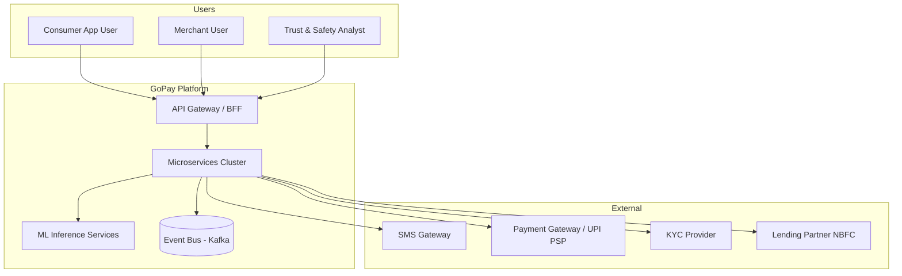
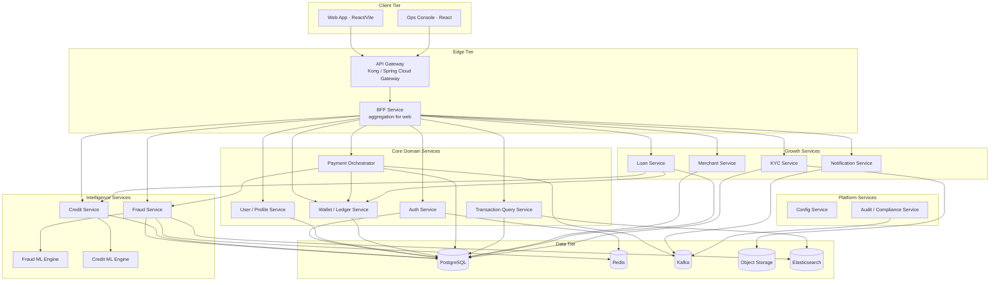
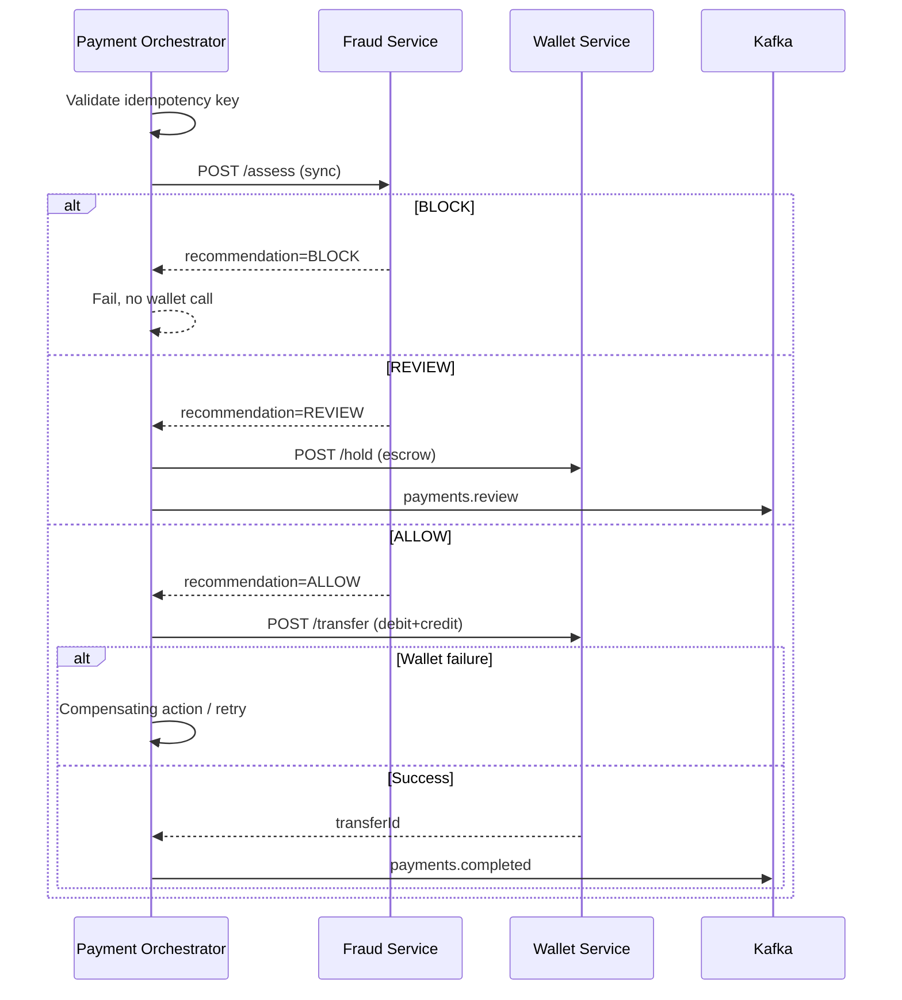
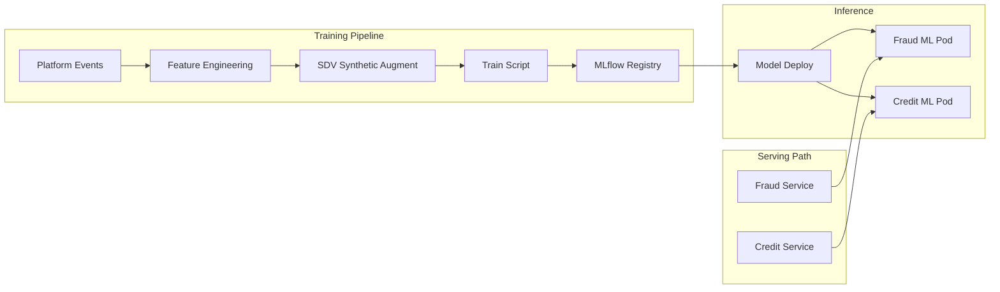
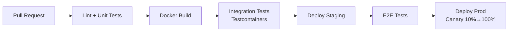
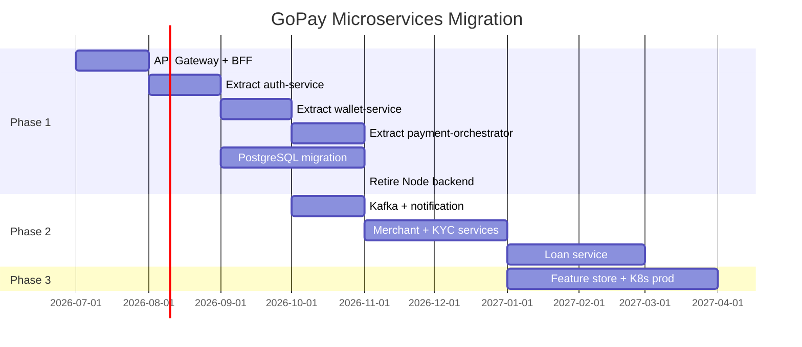

# GoPay — Technical Requirements Document (TRD)

| Field | Value |
|-------|-------|
| **Product** | GoPay |
| **Version** | 1.0 |
| **Status** | Draft |
| **Last updated** | July 2026 |
| **Audience** | Engineering, DevOps, Security, Architects |
| **Companion doc** | [PRD.md](./PRD.md) |

---

## 1. Executive Summary

This document defines the **target technical architecture** for GoPay: a **comprehensive microservices platform** for digital payments, wallet management, credit scoring, fraud detection, and embedded lending. It covers service decomposition, communication patterns, data ownership, infrastructure, security, observability, and a phased migration from the current **modular monolith + sidecar ML services** prototype.

**Current state:**

```
React SPA → Spring Boot monolith (8080) → JSON files
                ├── fraud-engine (Flask, 5002)
                └── credit-engine (Flask, 5001)
            (+ legacy Node auth backend — to retire)
```

**Target state:**

```
React SPA → API Gateway / BFF → 12+ domain microservices
                                      ├── PostgreSQL (per service)
                                      ├── Redis (cache, sessions)
                                      ├── Kafka (domain events)
                                      └── Object storage (KYC docs)
            ML inference cluster (fraud, credit, future models)
```

---

## 2. Architecture Principles

| # | Principle | Rationale |
|---|-----------|-----------|
| P1 | **Domain-driven decomposition** | Services align to business capabilities, not technical layers |
| P2 | **Database per service** | Each service owns its schema; no shared tables |
| P3 | **API-first contracts** | OpenAPI 3.1 specs published before implementation |
| P4 | **Event-driven where async fits** | Kafka for notifications, analytics, credit refresh; sync for fraud pre-check |
| P5 | **Fail-safe defaults** | Circuit breakers, timeouts, idempotency; rule fallbacks for ML |
| P6 | **Security by design** | Zero-trust inter-service mTLS, secrets in vault, least privilege |
| P7 | **Observable systems** | Structured logs, distributed tracing, RED/USE metrics per service |
| P8 | **Evolutionary migration** | Strangler fig pattern; no big-bang rewrite |

---

## 3. High-Level Architecture

### 3.1 System context (C4 Level 1)



### 3.2 Container diagram (C4 Level 2)



---

## 4. Microservices Catalog

### 4.1 Service registry

| Service | Responsibility | Tech (recommended) | Port | Phase |
|---------|----------------|-------------------|------|-------|
| **api-gateway** | Routing, TLS termination, rate limit, JWT validation | Kong / Spring Cloud Gateway | 443/8080 | P1 |
| **bff-web** | Aggregate endpoints for frontend; reduce chatty calls | Node.js / Spring WebFlux | 8081 | P1 |
| **auth-service** | Signup, login, OTP, JWT issue/refresh, session revoke | Java 21 + Spring Boot 3 | 8090 | P1 |
| **user-service** | Profile CRUD, preferences, device registry | Java 21 + Spring Boot 3 | 8091 | P1 |
| **wallet-service** | Balances, double-entry ledger, holds/escrow | Java 21 + Spring Boot 3 | 8092 | P1 |
| **payment-orchestrator** | Send-money saga, idempotency, fraud gate coordination | Java 21 + Spring Boot 3 | 8093 | P1 |
| **transaction-service** | Transaction history, search, export (read model) | Java 21 + Spring Boot 3 | 8094 | P1 |
| **fraud-service** | Rules, velocity, blacklist, case API, ML orchestration | Java 21 + Spring Boot 3 | 8095 | P1 |
| **fraud-ml-engine** | XGBoost inference, VPA/IFSC validators | Python 3.11 + Flask/FastAPI | 5002 | ✅ Exists |
| **credit-service** | Score API, score history, tips, pre-approval rules | Java 21 + Spring Boot 3 | 8096 | P1 |
| **credit-ml-engine** | GradientBoosting inference | Python 3.11 + Flask/FastAPI | 5001 | ✅ Exists |
| **notification-service** | SMS, email, push, in-app; template management | Node.js / Go | 8097 | P1–P2 |
| **kyc-service** | Document upload, verification workflow, tier status | Java 21 + Spring Boot 3 | 8098 | P2 |
| **merchant-service** | Merchant onboarding, QR, settlement | Java 21 + Spring Boot 3 | 8099 | P2 |
| **loan-service** | Application, underwriting orchestration, EMI schedule | Java 21 + Spring Boot 3 | 8100 | P2 |
| **audit-service** | Immutable audit log consumer, compliance queries | Java / Go | 8101 | P1 |
| **ops-console-api** | Admin: block user, case mgmt, blacklist CRUD | Java 21 + Spring Boot 3 | 8102 | P2 |

### 4.2 Service boundaries & data ownership

| Service | Owns (source of truth) | Does NOT own |
|---------|------------------------|--------------|
| auth-service | Credentials hash, refresh tokens, OTP state | Profile, balance |
| user-service | Profile fields, VPA, bank link metadata | Password, ledger entries |
| wallet-service | Account balances, ledger entries, holds | Transaction narrative, fraud scores |
| payment-orchestrator | Payment intents, saga state, idempotency keys | Long-term txn read models |
| transaction-service | Denormalized txn projections (CQRS read side) | Balance mutations |
| fraud-service | Blacklists, velocity counters, fraud events, cases | User PII beyond IDs |
| credit-service | Score snapshots, offer eligibility | Raw ML model weights |
| kyc-service | KYC documents (S3), verification status | PAN in profile (reference only) |
| merchant-service | Merchant profiles, QR mappings, settlement batches | Consumer wallet |
| loan-service | Loan applications, schedules, repayment state | Credit model internals |

### 4.3 Bounded context map

```
┌────────────────┐     ┌────────────────┐     ┌────────────────┐
│    Identity    │     │    Payments    │     │  Intelligence  │
│  auth-service  │     │ wallet-service │     │ fraud-service  │
│  user-service  │     │ pay-orchestrator│    │ credit-service │
│  kyc-service   │     │ txn-service    │     │ *-ml-engine    │
└───────┬────────┘     └───────┬────────┘     └───────┬────────┘
        │                      │                      │
        └──────────────────────┼──────────────────────┘
                               │
                    ┌──────────▼──────────┐
                    │     Growth & Ops      │
                    │ merchant, loan,     │
                    │ notification, audit │
                    └─────────────────────┘
```

---

## 5. Communication Patterns

### 5.1 Sync vs async matrix

| Interaction | Pattern | Protocol | Timeout | Fallback |
|-------------|---------|----------|---------|----------|
| Client → Gateway | REST | HTTPS/JSON | 30s | 429 rate limit |
| Gateway → Services | REST | HTTP/JSON + JWT | 10s | Circuit breaker |
| Payment → Fraud (pre-check) | Sync REST | HTTP/JSON | **200ms** hard | Java rule engine |
| Payment → Wallet (debit/credit) | Sync REST | HTTP/JSON | 2s | Saga retry |
| Credit → ML Engine | Sync REST | HTTP/JSON | 3s | Rule-based score |
| Fraud → ML Engine | Sync REST | HTTP/JSON | 3s | Rule-based score |
| Any → Notification | **Async** | Kafka event | — | DLQ + retry |
| Payment completed → Credit refresh | **Async** | Kafka event | — | Scheduled batch |
| Fraud REVIEW → Ops queue | **Async** | Kafka event | — | Polling fallback |
| Audit log | **Async** | Kafka event | — | Local buffer |

### 5.2 Kafka topic catalog

| Topic | Producer | Consumer(s) | Payload summary |
|-------|----------|---------------|-----------------|
| `gopay.payments.initiated` | payment-orchestrator | audit, analytics | intentId, userId, amount |
| `gopay.payments.completed` | payment-orchestrator | notification, credit, txn-projection | txnId, parties, amount, fraudMeta |
| `gopay.payments.failed` | payment-orchestrator | notification, audit | reason, fraudMeta |
| `gopay.payments.review` | payment-orchestrator | fraud-service, ops | escrowHoldId, signals |
| `gopay.fraud.alerts` | fraud-service | notification, ops | severity, userId, caseId |
| `gopay.credit.recalculate` | payment-orchestrator, loan-service | credit-service | userId, trigger |
| `gopay.users.kyc.updated` | kyc-service | user-service, wallet-service | userId, tier |
| `gopay.notifications.dispatch` | any | notification-service | channel, template, recipient |
| `gopay.audit.events` | all services | audit-service | actor, action, resource |

**Partitioning:** Key by `userId` for user-scoped ordering; by `txnId` for payment events.

**Retention:** 7 days hot; archive to S3 for 7 years (audit/compliance topics).

### 5.3 Payment saga (send money)



**Saga states:** `INITIATED → FRAUD_CHECKED → WALLET_DEBITED → COMPLETED | FAILED | REVIEW_HELD`

**Idempotency:** Client header `Idempotency-Key: UUID`; stored in `payment_intents` with 24h TTL.

---

## 6. API Design Standards

### 6.1 Conventions

| Rule | Standard |
|------|----------|
| Base path | `/api/v1/{service-domain}/...` via gateway |
| Auth | `Authorization: Bearer <JWT>` |
| Errors | RFC 7807 Problem Details `{ type, title, status, detail, traceId }` |
| Pagination | `?page=1&size=20`; response `{ data, meta: { total, page, size } }` |
| Idempotency | `Idempotency-Key` on all mutating payment endpoints |
| Correlation | `X-Request-Id` propagated across services |
| Versioning | URL path `/v1`; breaking changes → `/v2` |

### 6.2 Core API surface (Phase 1)

#### Auth Service (`/api/v1/auth`)

| Method | Path | Description |
|--------|------|-------------|
| POST | `/signup` | Register; triggers OTP |
| POST | `/login` | Email/mobile + password → JWT pair |
| POST | `/otp/verify` | Verify OTP |
| POST | `/otp/resend` | Resend OTP |
| POST | `/token/refresh` | Refresh access token |
| POST | `/logout` | Revoke refresh token |

#### User Service (`/api/v1/users`)

| Method | Path | Description |
|--------|------|-------------|
| GET | `/me` | Current user profile |
| PATCH | `/me` | Update profile (validated fields) |
| POST | `/me/vpa/validate` | Proxy to fraud VPA check |
| POST | `/me/ifsc/validate` | Proxy to fraud IFSC check |

#### Wallet Service (`/api/v1/wallet`)

| Method | Path | Description |
|--------|------|-------------|
| GET | `/balance` | Available + held balance |
| GET | `/ledger` | Paginated ledger entries |
| POST | `/hold` | Internal: escrow hold (orchestrator only) |
| POST | `/release` | Internal: release hold |
| POST | `/transfer` | Internal: atomic debit+credit |

#### Payment Orchestrator (`/api/v1/payments`)

| Method | Path | Description |
|--------|------|-------------|
| POST | `/send` | P2P payment (idempotent) |
| GET | `/intents/{id}` | Payment intent status |

#### Transaction Service (`/api/v1/transactions`)

| Method | Path | Description |
|--------|------|-------------|
| GET | `/` | History (filter: direction, date) |
| GET | `/{id}` | Transaction detail |
| GET | `/export` | CSV export |

#### Fraud Service (`/api/v1/fraud`)

| Method | Path | Description |
|--------|------|-------------|
| POST | `/assess` | Internal + optional dev exposure |
| GET | `/velocity` | User velocity vs limits |
| GET | `/events` | Paginated fraud event log |

#### Credit Service (`/api/v1/credit`)

| Method | Path | Description |
|--------|------|-------------|
| GET | `/score` | Current score + breakdown |
| GET | `/history` | Score over time |

### 6.3 ML engine contracts (existing, to formalize as OpenAPI)

**Fraud ML (`fraud-ml-engine:5002`)**

| Method | Path | SLA |
|--------|------|-----|
| POST | `/assess` | p95 < 100ms |
| POST | `/vpa-check` | p95 < 50ms |
| POST | `/ifsc-validate` | p95 < 50ms |
| GET | `/health` | — |

**Credit ML (`credit-ml-engine:5001`)**

| Method | Path | SLA |
|--------|------|-----|
| POST | `/score` | p95 < 150ms |
| GET | `/health` | — |

**Migration note:** Frontend must **stop calling ML engines directly** (current Profile page hack). All validation routes through gateway → user-service → fraud-service → ML.

---

## 7. Data Architecture

### 7.1 Store selection

| Store | Usage | Services |
|-------|-------|----------|
| **PostgreSQL 16** | Transactional source of truth | All domain services (separate DB/schema per service) |
| **Redis 7** | Sessions, OTP, velocity counters, idempotency cache | auth, fraud, payment-orchestrator |
| **Apache Kafka 3.x** | Domain events, async integration | All producers/consumers |
| **Elasticsearch 8** | Fraud event search, txn full-text search | txn-service, fraud-service |
| **S3 / MinIO** | KYC documents, ML artifacts, statement PDFs | kyc-service, ML pipelines |
| **MLflow** | Model registry, experiment tracking | fraud-ml, credit-ml |

### 7.2 Schema highlights

#### wallet-service — ledger (double-entry)

```sql
-- accounts: one WALLET account per user
CREATE TABLE accounts (
  id          UUID PRIMARY KEY,
  user_id     UUID NOT NULL UNIQUE,
  currency    CHAR(3) DEFAULT 'INR',
  created_at  TIMESTAMPTZ NOT NULL
);

-- ledger_entries: append-only, never update/delete
CREATE TABLE ledger_entries (
  id            UUID PRIMARY KEY,
  account_id    UUID NOT NULL REFERENCES accounts(id),
  txn_id        UUID NOT NULL,
  entry_type    VARCHAR(10) NOT NULL, -- DEBIT | CREDIT
  amount        NUMERIC(18,2) NOT NULL CHECK (amount > 0),
  balance_after NUMERIC(18,2) NOT NULL,
  created_at    TIMESTAMPTZ NOT NULL
);

-- holds: escrow for REVIEW
CREATE TABLE holds (
  id          UUID PRIMARY KEY,
  account_id  UUID NOT NULL,
  amount      NUMERIC(18,2) NOT NULL,
  reason      VARCHAR(50), -- FRAUD_REVIEW
  status      VARCHAR(20), -- ACTIVE | RELEASED | CAPTURED
  payment_id  UUID NOT NULL,
  created_at  TIMESTAMPTZ NOT NULL
);
```

#### payment-orchestrator — intents & saga

```sql
CREATE TABLE payment_intents (
  id                UUID PRIMARY KEY,
  idempotency_key   VARCHAR(64) NOT NULL UNIQUE,
  sender_user_id    UUID NOT NULL,
  recipient_ref     VARCHAR(255) NOT NULL,
  amount            NUMERIC(18,2) NOT NULL,
  note              TEXT,
  status            VARCHAR(30) NOT NULL,
  fraud_assessment  JSONB,
  wallet_transfer_id UUID,
  created_at        TIMESTAMPTZ NOT NULL,
  updated_at        TIMESTAMPTZ NOT NULL
);
```

### 7.3 Migration from JSON files

| Current file | Target service | Migration strategy |
|--------------|----------------|-------------------|
| `users.json` | auth-service + user-service + wallet-service | Split: credentials → auth; profile → user; balance → wallet accounts |
| `sessions.json` | auth-service (Redis) | One-time import not needed; force re-login |
| `transactions.json` | txn-service (+ wallet ledger backfill) | ETL script: create ledger entries from historical txns |
| `fraud_events.json` | fraud-service (PostgreSQL + ES) | Bulk import via migration job |

**Cutover:** Dual-write period (Spring monolith + new services) behind feature flag; validate balance reconciliation daily.

---

## 8. Security Architecture

### 8.1 Authentication & authorization

| Layer | Mechanism |
|-------|-----------|
| Client auth | JWT access token (15 min) + refresh token (7 days, HTTP-only cookie) |
| Token signing | RS256 asymmetric; JWKS endpoint on auth-service |
| Inter-service | mTLS (service mesh) OR signed service tokens |
| RBAC roles | `USER`, `MERCHANT`, `OPS_ANALYST`, `ADMIN` |
| Gateway | Validates JWT; injects `X-User-Id`, `X-Roles` headers |

**Password storage:** Argon2id (migrate from current SHA-256 + salt).

### 8.2 Security controls

| Control | Implementation | Phase |
|---------|----------------|-------|
| Rate limiting | Gateway: 100 req/min/user; 10 login attempts/hr/IP | P1 |
| CORS | Allowlist frontend origins only | P1 |
| Input validation | Bean Validation (Java), Pydantic (Python) | P1 |
| PII encryption | AES-256 for bank account at rest | P1 |
| Secrets | HashiCorp Vault / AWS Secrets Manager | P1 |
| WAF | Cloud WAF on gateway | P2 |
| Pen test | Annual third-party | P2 |

### 8.3 Network zones

```
Internet → WAF → API Gateway (DMZ)
                    ↓
              Service Mesh (internal)
                    ↓
         PostgreSQL / Redis / Kafka (data zone, no public ingress)
```

ML engines: internal network only; no browser access.

---

## 9. Non-Functional Requirements (NFRs)

### 9.1 Performance

| Metric | Target |
|--------|--------|
| API Gateway p95 latency (excl. ML) | < 100 ms |
| Send payment end-to-end p95 | < 500 ms |
| Fraud pre-check p95 | < 200 ms |
| Credit score fetch p95 | < 300 ms |
| Throughput (Phase 1) | 500 TPS sustained |
| Throughput (Phase 3) | 5,000 TPS sustained |

### 9.2 Availability & reliability

| Metric | Target |
|--------|--------|
| Platform availability | 99.9% (Phase 1), 99.95% (Phase 3) |
| RPO (data loss) | 0 for ledger; < 1 min for events |
| RTO (recovery) | < 30 min per service |
| ML fallback | Rule engine activates within 1 failed call |

### 9.3 Scalability

| Component | Scaling strategy |
|-----------|------------------|
| Stateless services | HPA on CPU/memory; min 2 replicas |
| wallet-service | Vertical + sharding by userId range (Phase 3) |
| fraud-ml-engine | GPU optional; horizontal replicas behind load balancer |
| Kafka | 3 brokers min; increase partitions with load |
| PostgreSQL | Read replicas for txn-service; Citus/sharding Phase 3 |

### 9.4 Observability

| Pillar | Tool (recommended) |
|--------|-------------------|
| Logs | Structured JSON → ELK / Loki |
| Metrics | Prometheus + Grafana (RED metrics per service) |
| Traces | OpenTelemetry → Jaeger / Tempo |
| Alerts | PagerDuty on SLO burn rate |
| Dashboards | GMV, fraud block rate, ML latency, error budget |

**Mandatory log fields:** `traceId`, `spanId`, `service`, `userId`, `requestId`, `durationMs`.

---

## 10. ML Platform Requirements

### 10.1 Current ML stack (preserve & harden)

| Engine | Model | Features | Fallback |
|--------|-------|----------|----------|
| fraud-ml-engine | XGBoost v2 | 20 features | Java 7-layer rules in fraud-service |
| credit-ml-engine | GradientBoosting | 8 features | Java rule-based score |

### 10.2 Target ML platform



| Requirement | Detail |
|-------------|--------|
| Model versioning | Semantic version in MLflow; `/health` returns `{ modelVersion }` |
| Feature store | Redis + PostgreSQL materialized features (Phase 3) |
| A/B testing | Shadow mode: score logged but not enforced (Phase 3) |
| Retraining | Weekly batch + trigger on drift detection |
| Explainability | SHAP top-5 features returned in `/assess` response |
| Training data | SDV synthetic + anonymized production events |

### 10.3 Fraud cascade (retain & extend)

Current 7-layer cascade in `FraudService` maps to fraud-service microservice:

0. VPA spoofing + IFSC validation (ML engine)
1. Blacklist (disposable email, keywords) — **hot reload via Redis pub/sub**
2. Hard velocity limits (Redis counters)
3–4. XGBoost ML (ML engine)
5. Java rule fallback
6. **(New)** Case creation on REVIEW → Kafka → ops-console

---

## 11. Infrastructure & DevOps

### 11.1 Environment strategy

| Environment | Purpose | Infrastructure |
|-------------|---------|----------------|
| **local** | Developer machines | Docker Compose (all services) |
| **dev** | Integration testing | Kubernetes (single cluster) |
| **staging** | Pre-prod, load tests | Kubernetes (mirrors prod) |
| **prod** | Live users | Kubernetes multi-AZ |

### 11.2 Docker Compose (local dev target)

```yaml
# docker-compose.yml (conceptual — 15+ services)
services:
  postgres:      { image: postgres:16 }
  redis:         { image: redis:7 }
  kafka:         { image: bitnami/kafka:3 }
  api-gateway:   { build: ./services/api-gateway }
  auth-service:  { build: ./services/auth-service }
  user-service:  { build: ./services/user-service }
  wallet-service: { build: ./services/wallet-service }
  payment-orchestrator: { build: ./services/payment-orchestrator }
  transaction-service:  { build: ./services/transaction-service }
  fraud-service: { build: ./services/fraud-service }
  credit-service: { build: ./services/credit-service }
  notification-service: { build: ./services/notification-service }
  fraud-ml-engine: { build: ./fraud-engine }
  credit-ml-engine: { build: ./credit-engine }
  frontend:      { build: ./frontend }
```

### 11.3 CI/CD pipeline



| Stage | Gate |
|-------|------|
| PR | 80% unit test coverage on payment/wallet paths |
| Integration | Testcontainers: Postgres, Redis, Kafka |
| Staging | k6 load test: 100 TPS for 10 min |
| Prod | Manual approval + canary |

### 11.4 Repository strategy

**Option A (recommended for team scale):** Monorepo with `/services/{name}` per microservice, shared `/proto` or `/openapi`, `/infra` for K8s manifests.

```
Payment app/
├── frontend/
├── services/
│   ├── api-gateway/
│   ├── auth-service/
│   ├── user-service/
│   ├── wallet-service/
│   ├── payment-orchestrator/
│   ├── transaction-service/
│   ├── fraud-service/
│   ├── credit-service/
│   └── notification-service/
├── ml/
│   ├── fraud-engine/      # rename from fraud-engine/
│   └── credit-engine/
├── infra/
│   ├── docker-compose.yml
│   ├── k8s/
│   └── terraform/
├── openapi/               # shared API specs
└── docs/
    ├── PRD.md
    └── TRD.md
```

**Option B (current):** Keep extracting from `backend-spring/` incrementally using strangler fig.

---

## 12. Migration Plan

### 12.1 Strangler fig phases



### 12.2 Phase 1 detailed steps

| Step | Action | Risk | Rollback |
|------|--------|------|----------|
| 1 | Deploy API Gateway; route `/api/v1/*` to existing Spring monolith | Low | DNS revert |
| 2 | Introduce PostgreSQL; dual-write users alongside JSON | Medium | Read from JSON |
| 3 | Extract auth-service; gateway routes `/auth/*` to new service | Medium | Route to monolith |
| 4 | Extract wallet-service with ledger; reconcile balances nightly | **High** | Monolith sole writer |
| 5 | Extract payment-orchestrator; saga wraps fraud + wallet | **High** | Feature flag off |
| 6 | Extract transaction-service (CQRS consumer from Kafka) | Low | Monolith read API |
| 7 | Retire Node backend; update README | Low | — |
| 8 | Remove JSON writes; PostgreSQL source of truth | Medium | Restore JSON backup |

### 12.3 Decommission checklist (Spring monolith)

- [ ] All gateway routes point to extracted services
- [ ] No production traffic to `backend-spring` for 30 days in staging
- [ ] Balance reconciliation 100% match for 7 consecutive days
- [ ] JSON files archived to S3
- [ ] Monolith code archived (not deleted) for reference

---

## 13. Testing Strategy

| Level | Scope | Tools |
|-------|-------|-------|
| Unit | Service business logic, saga steps | JUnit 5, pytest |
| Integration | DB, Redis, Kafka with Testcontainers | Spring Boot Test |
| Contract | OpenAPI consumer-driven contracts | Pact |
| E2E | Full send-money flow | Playwright + staging |
| Load | 500 TPS payment mix | k6 |
| Chaos | ML service down, Kafka lag | Litmus / manual |
| Security | OWASP Top 10 | OWASP ZAP, Snyk |

**Critical test scenarios:**

1. Concurrent sends from same user (no double debit)
2. Idempotent retry of same `Idempotency-Key`
3. Fraud BLOCK → no wallet mutation
4. Fraud REVIEW → hold created, funds not lost
5. ML timeout → rule fallback within 200ms budget
6. Kafka consumer lag → credit score eventually consistent

---

## 14. Current vs Target Gap Analysis

| Area | Current | Target | Priority |
|------|---------|--------|----------|
| Architecture | Spring monolith + 2 Python sidecars | 12+ microservices + event bus | P1 |
| Persistence | JSON files | PostgreSQL + Redis + Kafka | P1 |
| Auth | Bearer token, SHA-256, localStorage | JWT + refresh, Argon2id, HTTP-only cookie | P1 |
| Payments | Direct balance mutation | Saga + ledger + idempotency | P1 |
| Fraud REVIEW | Logged only | Escrow + ops queue | P1 |
| Frontend → ML | Direct :5002 calls from Profile | Gateway-proxied only | P1 |
| ML URLs | Hardcoded localhost in Java | Config + service discovery + circuit breaker | P1 |
| Observability | Console logs | OTel + centralized logging | P1 |
| Notifications | None | Kafka-driven SMS/email | P1–P2 |
| Merchant/Lending | UI copy only | Dedicated services | P2 |
| K8s / Terraform | None | Full IaC | P2–P3 |

---

## 15. Technology Stack Summary

| Layer | Technology |
|-------|------------|
| Frontend | React 19, TypeScript, Vite, Tailwind CSS 4, React Router 7 |
| API Gateway | Kong or Spring Cloud Gateway |
| Domain services | Java 21, Spring Boot 3.3, Spring Data JPA |
| ML inference | Python 3.11, FastAPI (migrate from Flask), XGBoost, scikit-learn |
| Primary DB | PostgreSQL 16 |
| Cache | Redis 7 |
| Event bus | Apache Kafka 3.x |
| Search | Elasticsearch 8 |
| Object storage | MinIO (local) / S3 (prod) |
| Container runtime | Docker |
| Orchestration | Kubernetes (EKS/GKE) |
| IaC | Terraform |
| CI/CD | GitHub Actions |
| Observability | OpenTelemetry, Prometheus, Grafana, Loki |
| ML ops | MLflow |

---

## 16. Open Technical Decisions

| # | Decision | Options | Recommendation | By |
|---|----------|---------|----------------|-----|
| 1 | API Gateway | Kong vs Spring Cloud Gateway vs Envoy | Spring Cloud Gateway (Java team familiarity) | P1 start |
| 2 | Service mesh | None vs Istio vs Linkerd | Linkerd (lighter) if mTLS needed | P2 |
| 3 | Monorepo vs polyrepo | Monorepo vs per-service repos | Monorepo for < 10 engineers | Now |
| 4 | CQRS for transactions | Shared DB vs Kafka projection | Kafka projection (txn-service) | P1 |
| 5 | Wallet sharding | Single PG vs Citus | Single PG until 1M users | P3 |
| 6 | ML serving | Flask vs FastAPI vs Triton | FastAPI + optional Triton at scale | P1 |
| 7 | BFF framework | Node vs Spring WebFlux | Spring WebFlux (shared libs with domain) | P1 |

---

## 17. Appendix

### A. Port allocation (local dev)

| Service | Port |
|---------|------|
| frontend (Vite) | 5173 |
| api-gateway | 8080 |
| bff-web | 8081 |
| auth-service | 8090 |
| user-service | 8091 |
| wallet-service | 8092 |
| payment-orchestrator | 8093 |
| transaction-service | 8094 |
| fraud-service | 8095 |
| credit-service | 8096 |
| notification-service | 8097 |
| fraud-ml-engine | 5002 |
| credit-ml-engine | 5001 |
| PostgreSQL | 5432 |
| Redis | 6379 |
| Kafka | 9092 |

### B. Reference — existing Spring endpoints (migration source)

These endpoints in `backend-spring` are the baseline for Phase 1 API parity:

- `POST /api/v1/auth/signup`, `/login`, `/logout`
- `GET/PATCH /api/v1/me`
- `GET /api/v1/wallet/balance`
- `POST /api/v1/transactions/send`
- `GET /api/v1/transactions`
- `GET /api/v1/credit/score`
- `GET /api/v1/fraud/velocity`, `/events`

### C. Related documentation

| Document | Path |
|----------|------|
| Product requirements | [PRD.md](./PRD.md) |
| ML models deep dive | [ML_MODELS_DEEP_DIVE.md](./ML_MODELS_DEEP_DIVE.md) |
| Fraud engine README | [../fraud-engine/README.md](../fraud-engine/README.md) |
| Credit engine README | [../credit-engine/README.md](../credit-engine/README.md) |

---

*This TRD is a living document. Update version and changelog when service boundaries or NFRs change.*
